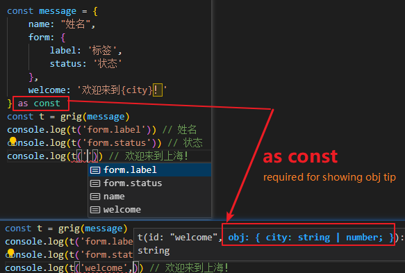

[English](#use-as-a-formatter)|[中文](#直接使用)|[Demos](#demos)|[示例](#示例)


 **grig**: a lightweight and easy-to-use i18n library, with TS **smart prompts**.
 Can be used in react、vue3、svelte、solid ...


<!--  -->

- [Use as a formatter](#use-as-a-formatter)
- [React](#react)
- [Vue3](#vue3)
- [Svelte](#svelte)
- [Solid](#solid)
- [General Instance Usage](#general-instance-usage)
- [Demos](#demos)
- [Installation](#安装-installation)


#### Use as a formatter

```typescript
import { grig } from "grig";
const message = {
    name: "姓名",
    form: { status: "状态" },
    welcome: "欢迎来到{city}！",
    own: (count: number) => `我有${count}个苹果`,
} as const;
const t = grig(message);
console.log(t("name")); // 姓名
console.log(t("form.status")); // 状态
console.log(t("welcome", { city: "上海" })); // 欢迎来到上海！
console.log(t("own", 2)); //我有2个苹果
```

#### React

###### 1.Create a grig Instance

```typescript
//./lang/init
import { createGrigReact } from "grig/react";
const zh_global = { g_welcome: "全局_欢迎" } as const;
const en_global = { g_welcome: "Global Welcome" } as const;
const global_messages = { zh: zh_global, en: en_global };
export const { tMessages, useGrigContext, useMessages, GrigProvider,getLang } =
    createGrigReact({ lang: "zh", fallbackLang: "en" }, global_messages);
```

###### 2.Use it anywhere

```tsx
import { useState } from "react";
import { useMessages } from "../lang/init";
export function Content() {
    const t = useMessages({
        zh: { world: "世界" },
        en: { world: "World" },
    });
    return (
        <div className="content card">
            <div>child: Content.tsx</div>
            <span>{t("g_welcome")}</span>
            <span>{t("world")}</span>
        </div>
    );
}
```

###### 3.Switch the lang

```tsx
import { useGrigContext } from "../lang/init";
export default function SwitchLang() {
    const { lang, setLang } = useGrigContext();
    const t = tMessages({
        zh: { lang: "中文" },
        en: { lang: "English" },
    });
    return (
        <div className="lang-switch card">
            <div>child: SwitchLang.tsx</div>
            <button
                onClick={() => {
                    setLang(lang === "en" ? "zh" : "en");
                }}
            >
                {lang} {t("lang")}
            </button>
        </div>
    );
}
```

###### 4.Refresh DOM by Wrap App with GrigProvider

```tsx
import "./app.css";
import SwitchLang from "./components/SwitchLang";
import Content from "./components/Content";
import { useEffect, useState } from "react";
import { GrigProvider } from "./lang/init";

export function App() {
    return (
        <GrigProvider>
            <div className="app card">
                <div>app.tsx</div>
                <SwitchLang />
                <Content />
            </div>
        </GrigProvider>
    );
}
```
#### Vue3

###### 1.Create a grig Instance

```typescript
//./lang/init
import { createGrigVue } from "grig/vue";
const zh_global = { g_welcome: "全局_欢迎" } as const;
const en_global = { g_welcome: "Global Welcome" } as const;
const global_messages = { zh: zh_global, en: en_global };
export const { tMessages, lang } = createGrigVue(
    { lang: "zh", fallbackLang: "en" },
    global_messages
);
```

###### 2.Use it anywhere

```vue
<template>
    <div className="content card">
        <div>child: Content.tsx</div>
        <span>{{ t("g_welcome") }}</span>
        <span>{{ t("world") }}</span>
    </div>
</template>
<script setup lang="ts">
    import { tMessages } from "../lang/init";
    const t = tMessages({
        zh: { world: "世界" },
        en: { world: "World" },
    });
</script>


```

###### 3.Switch the lang

```vue
<template>
    <div class="lang-switch card">
        <div>child: langSwitch.vue</div>
        <button @click="handleToggle">{{ t("lang") }} {{ lang }}</button>
    </div>
</template>
<script setup lang="ts">
import { lang, tMessages } from "../lang";

const handleToggle = () => {
    if (lang.value == "zh") {
        lang.value = "en";
    } else {
        lang.value = "zh";
    }
};
const t = tMessages({
    zh: {
        lang: "中文",
    },
    en: {
        lang: "English",
    },
});
</script>
```
#### Svelte

###### 1.Create a grig Instance

```typescript
//./lang/init
import { createGrigVue } from "grig/svelte";
const zh_global = { g_welcome: "全局_欢迎" } as const;
const en_global = { g_welcome: "Global Welcome" } as const;
const global_messages = { zh: zh_global, en: en_global };
export const { tMessages, lang} = 
createGrigSvetle({ lang: "zh", fallbackLang: "en" }, global_messages);

```

###### 2.Use it anywhere

```svelte

<script  lang="ts">
    import { tMessages } from "../lang/init";
    const t = tMessages({
        zh: { world: "世界" },
        en: { world: "World" },
    });
</script>
  <div className="content card">
        <div>child: Content.tsx</div>
        <span>{{ $t("g_welcome") }}</span>
        <span>{{ $t("world") }}</span>
    </div>

```

###### 3.Switch the lang

```svelte
<script lang="ts">
    import { tMessages, lang } from "../lang/init";
    const t = tMessages({  zh: { lang: "中文", },
     en: { lang: "English", },
    });
  </script>
  
  <div class="lang-switch card">
    <div>child: SwitchLang.svelte</div>
    <button
        on:click={() => {
            lang.update(_lang=>(_lang=== "en" ? "zh" : "en"));
        }}
    >
        {$lang} {$t("lang")}
    </button>
</div>
  
</script>
```

#### Solid

###### 1.Create a grig Instance

```typescript
//./lang/init
import { createGrigVue } from "grig/solid";
const zh_global = { g_welcome: "全局_欢迎" } as const;
const en_global = { g_welcome: "Global Welcome" } as const;
const global_messages = { zh: zh_global, en: en_global };
export const { tMessages, lang,setLang } = createGrigSolid({ lang: "zh", fallbackLang: "en" }, global_messages);
```

###### 2.Use it anywhere

```tsx
import { tMessages } from "../lang/init";
export function Content() {
    const t = tMessages({
        zh: { world: "世界" },
        en: { world: "World" },
    });
    return (
        <div className="content card">
            <div>child: Content.tsx</div>
            <span>{t("g_welcome")}</span>
            <span>{t("world")}</span>
        </div>
    );
}
```

###### 3.Switch the lang

```tsx
import { lang, setLang, tMessages } from "../lang/init";

const SwitchLang = () => {
  const t = tMessages({
    zh: {
      lang: "中文",
    },
    en: {
      lang: "English",
    },
  });
  return (
    <div class="lang-switch card">
      <div>child: SwitchLang.tsx</div>
      <button
        onClick={() => {
          setLang(lang() === "en" ? "zh" : "en");
        }}
      >
        {lang()} {t("lang")}
      </button>
    </div>
  );
};

```
#### General Instance Usage

###### 1.Create a grig Instance

```typescript
//./lang/init
import { createGrig } from "grig";
const zh_global = { g_welcome: "全局_欢迎" } as const;
const en_global = { g_welcome: "Global Welcome" } as const;
const global_messages = { zh: zh_global, en: en_global };
export const {
    tMessages,
    addLangChangeCallback,
    removeLangChangeCallback,
    getLang,
    setLang,
} = createGrig({ lang: "zh", fallbackLang: "en" }, global_messages);
```

###### 2.Use it anywhere

```tsx
import { useState } from "react";
import { tMessages } from "../lang/init";
export function Content() {
    const t = tMessages({
        zh: { world: "世界" },
        en: { world: "World" },
    });
    return (
        <div className="content card">
            <div>child: Content.tsx</div>
            <span>{t("g_welcome")}</span>
            <span>{t("world")}</span>
        </div>
    );
}
```

###### 3.Switch the lang

```tsx
import { getLang, setLang, tMessages } from "../lang/init";
export default function SwitchLang() {
    const t = tMessages({
        zh: { lang: "中文" },
        en: { lang: "English" },
    });
    return (
        <div className="lang-switch card">
            <div>child: SwitchLang.tsx</div>
            <button
                onClick={() => {
                    setLang(getLang() === "en" ? "zh" : "en");
                }}
            >
                {getLang()} {t("lang")}
            </button>
        </div>
    );
}
```

###### 4.Refresh DOM by key

```tsx
import "./app.css";
import SwitchLang from "./components/SwitchLang";
import Content from "./components/Content";
import { useEffect, useState } from "react";
import {
    addLangChangeCallback,
    getLang,
    removeLangChangeCallback,
} from "./lang/init";

export function App() {
    const [lang, setLang] = useState(getLang());
    useEffect(() => {
        addLangChangeCallback("langChange", (_lang) => {
            setLang(_lang);
        });
        return () => {
            removeLangChangeCallback("langChange");
        };
    }, []);

    return (
        <>
            <div className="app card" key={lang}>
                <div>app.tsx</div>
                <SwitchLang />
                <Content />
            </div>
        </>
    );
}
```

#### Demos

```bash
npx degit https://github.com/leafio/grig/examples grig-examples
```

#### Installation

```bash
npm install grig
```


**grig**：轻量易用的 i18n 库，含 TS 智能提示。 可在 react、vue3、svelte、solid等多种框架内使用。 


- [直接使用](#直接使用)
- [React](#react)
- [Vue3](#vue3)
- [Svelte](#svelte)
- [Solid](#solid)
- [通用用法](#通用用法)
- [示例](#示例)
- [安装](#安装n)

#### 直接使用

```typescript
import { grig } from "grig";
const message = {
    name: "姓名",
    form: { status: "状态" },
    welcome: "欢迎来到{city}！",
    own: (count: number) => `我有${count}个苹果`,
} as const;
const t = grig(message);
console.log(t("name")); // 姓名
console.log(t("form.status")); // 状态
console.log(t("welcome", { city: "上海" })); // 欢迎来到上海！
console.log(t("own", 2)); //我有2个苹果
```

#### React

###### 1.创建grig实例

```typescript
//./lang/init
import { createGrigReact } from "grig/react";
const zh_global = { g_welcome: "全局_欢迎" } as const;
const en_global = { g_welcome: "Global Welcome" } as const;
const global_messages = { zh: zh_global, en: en_global };
export const { tMessages, useGrigContext, useMessages, GrigProvider,getLang } =
    createGrigReact({ lang: "zh", fallbackLang: "en" }, global_messages);
```

###### 2.在任意组件内使用

```tsx
import { useState } from "react";
import { useMessages } from "../lang/init";
export function Content() {
    const t = useMessages({
        zh: { world: "世界" },
        en: { world: "World" },
    });
    return (
        <div className="content card">
            <div>child: Content.tsx</div>
            <span>{t("g_welcome")}</span>
            <span>{t("world")}</span>
        </div>
    );
}
```

###### 3.切换语言

```tsx
import { useGrigContext } from "../lang/init";
export default function SwitchLang() {
    const { lang, setLang } = useGrigContext();
    const t = tMessages({
        zh: { lang: "中文" },
        en: { lang: "English" },
    });
    return (
        <div className="lang-switch card">
            <div>child: SwitchLang.tsx</div>
            <button
                onClick={() => {
                    setLang(lang === "en" ? "zh" : "en");
                }}
            >
                {lang} {t("lang")}
            </button>
        </div>
    );
}
```

###### 4.用GrigProvider包裹App刷新DOM

```tsx
import "./app.css";
import SwitchLang from "./components/SwitchLang";
import Content from "./components/Content";
import { useEffect, useState } from "react";
import { GrigProvider } from "./lang/init";

export function App() {
    return (
        <GrigProvider>
            <div className="app card">
                <div>app.tsx</div>
                <SwitchLang />
                <Content />
            </div>
        </GrigProvider>
    );
}
```
#### Vue3

###### 1.创建grig实例

```typescript
//./lang/init
import { createGrigVue } from "grig/vue";
const zh_global = { g_welcome: "全局_欢迎" } as const;
const en_global = { g_welcome: "Global Welcome" } as const;
const global_messages = { zh: zh_global, en: en_global };
export const { tMessages, lang } = createGrigVue(
    { lang: "zh", fallbackLang: "en" },
    global_messages
);
```

###### 2.在任意组件内使用

```vue
<template>
    <div className="content card">
        <div>child: Content.tsx</div>
        <span>{{ t("g_welcome") }}</span>
        <span>{{ t("world") }}</span>
    </div>
</template>
<script setup lang="ts">
    import { tMessages } from "../lang/init";
    const t = tMessages({
        zh: { world: "世界" },
        en: { world: "World" },
    });
</script>


```

###### 3.切换语言

```vue
<template>
    <div class="lang-switch card">
        <div>child: langSwitch.vue</div>
        <button @click="handleToggle">{{ t("lang") }} {{ lang }}</button>
    </div>
</template>
<script setup lang="ts">
import { lang, tMessages } from "../lang";

const handleToggle = () => {
    if (lang.value == "zh") {
        lang.value = "en";
    } else {
        lang.value = "zh";
    }
};
const t = tMessages({
    zh: {
        lang: "中文",
    },
    en: {
        lang: "English",
    },
});
</script>
```
#### Svelte

###### 1.创建grig实例

```typescript
//./lang/init
import { createGrigVue } from "grig/svelte";
const zh_global = { g_welcome: "全局_欢迎" } as const;
const en_global = { g_welcome: "Global Welcome" } as const;
const global_messages = { zh: zh_global, en: en_global };
export const { tMessages, lang} = 
createGrigSvetle({ lang: "zh", fallbackLang: "en" }, global_messages);

```

###### 2.在任意组件内使用

```svelte

<script  lang="ts">
    import { tMessages } from "../lang/init";
    const t = tMessages({
        zh: { world: "世界" },
        en: { world: "World" },
    });
</script>
  <div className="content card">
        <div>child: Content.tsx</div>
        <span>{{ $t("g_welcome") }}</span>
        <span>{{ $t("world") }}</span>
    </div>

```

###### 3.切换语言

```svelte
<script lang="ts">
    import { tMessages, lang } from "../lang/init";
    const t = tMessages({  zh: { lang: "中文", },
     en: { lang: "English", },
    });
  </script>
  
  <div class="lang-switch card">
    <div>child: SwitchLang.svelte</div>
    <button
        on:click={() => {
            lang.update(_lang=>(_lang=== "en" ? "zh" : "en"));
        }}
    >
        {$lang} {$t("lang")}
    </button>
</div>
  
</script>
```

#### Solid

###### 1.创建grig实例

```typescript
//./lang/init
import { createGrigVue } from "grig/solid";
const zh_global = { g_welcome: "全局_欢迎" } as const;
const en_global = { g_welcome: "Global Welcome" } as const;
const global_messages = { zh: zh_global, en: en_global };
export const { tMessages, lang,setLang } = createGrigSolid({ lang: "zh", fallbackLang: "en" }, global_messages);
```

###### 2.在任意组件内使用

```tsx
import { tMessages } from "../lang/init";
export function Content() {
    const t = tMessages({
        zh: { world: "世界" },
        en: { world: "World" },
    });
    return (
        <div className="content card">
            <div>child: Content.tsx</div>
            <span>{t("g_welcome")}</span>
            <span>{t("world")}</span>
        </div>
    );
}
```

###### 3.切换语言

```tsx
import { lang, setLang, tMessages } from "../lang/init";

const SwitchLang = () => {
  const t = tMessages({
    zh: {
      lang: "中文",
    },
    en: {
      lang: "English",
    },
  });
  return (
    <div class="lang-switch card">
      <div>child: SwitchLang.tsx</div>
      <button
        onClick={() => {
          setLang(lang() === "en" ? "zh" : "en");
        }}
      >
        {lang()} {t("lang")}
      </button>
    </div>
  );
};

```
#### 通用用法

###### 1.创建实例

```typescript
//./lang/init
import { createGrig } from "grig";
const zh_global = { g_welcome: "全局_欢迎" } as const;
const en_global = { g_welcome: "Global Welcome" } as const;
const global_messages = { zh: zh_global, en: en_global };
export const {
    tMessages,
    addLangChangeCallback,
    removeLangChangeCallback,
    getLang,
    setLang,
} = createGrig({ lang: "zh", fallbackLang: "en" }, global_messages);
```

###### 2.在任意组件内使用

```tsx
import { useState } from "react";
import { tMessages } from "../lang/init";
export function Content() {
    const t = tMessages({
        zh: { world: "世界" },
        en: { world: "World" },
    });
    return (
        <div className="content card">
            <div>child: Content.tsx</div>
            <span>{t("g_welcome")}</span>
            <span>{t("world")}</span>
        </div>
    );
}
```

###### 3.切换语言

```tsx
import { getLang, setLang, tMessages } from "../lang/init";
export default function SwitchLang() {
    const t = tMessages({
        zh: { lang: "中文" },
        en: { lang: "English" },
    });
    return (
        <div className="lang-switch card">
            <div>child: SwitchLang.tsx</div>
            <button
                onClick={() => {
                    setLang(getLang() === "en" ? "zh" : "en");
                }}
            >
                {getLang()} {t("lang")}
            </button>
        </div>
    );
}
```

###### 4.通过key刷新DOM

```tsx
import "./app.css";
import SwitchLang from "./components/SwitchLang";
import Content from "./components/Content";
import { useEffect, useState } from "react";
import {
    addLangChangeCallback,
    getLang,
    removeLangChangeCallback,
} from "./lang/init";

export function App() {
    const [lang, setLang] = useState(getLang());
    useEffect(() => {
        addLangChangeCallback("langChange", (_lang) => {
            setLang(_lang);
        });
        return () => {
            removeLangChangeCallback("langChange");
        };
    }, []);

    return (
        <>
            <div className="app card" key={lang}>
                <div>app.tsx</div>
                <SwitchLang />
                <Content />
            </div>
        </>
    );
}
```

#### 示例

```bash
npx degit https://github.com/leafio/grig/examples grig-examples
```

#### 安装

```bash
npm install grig
```